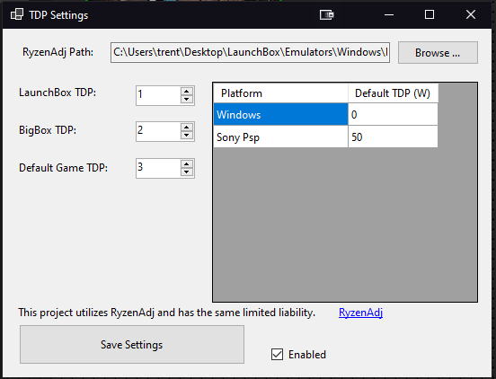

### Features

-- Extend Launchbox so that it can set the TDP of Supported Ryzen APUs when games are launched.
-- TDPs can be set at the Global, Platform/Emulator, and game level.

# Ryxen TDP Manager - Launchbox Plugin

###Installation

1.  Unzip the zip file from Releases to the Launchbox/Plugins folder.
2. Download the lastest release of Ryzen Adj from the links below. Unzip the zip file you downloaded and place it somewhere on your PC.
3. Load Launchbox and select the "Tools->Set TDP Option For Ryzen ..." Menu Item to open the settings menu.
4. Use the "Browse ..." Button to set the path to the ryzenadj.exe file you downloaded and unzipped in step 2.
5. In the settings menu you can set the default TDPs for Bigbox, LaunchBox, and each platform.
6. Enable the plugin by checking the enabled Checkbox and save your settings yusing the save buttton.

###Setting TDP at the game level
1. To set the TDP at the game level you need to create a custom field name "TDP" and set the valuse to the TDP you want that game to use.
2. To Create a Custom field for a game right click on the game and select the "Edit" menu item.
3. In the Game's Properties dialog box select Custom fields form the list on the left.
4. Double click on a blank table cell inthe name column and set the name to TDP.
5. Double Click on the corresponding Cell in the Value column and put the TDP you wish to use for that game.

Ex. for a 5W tdp
Name| Value
TDP   |   5   

###Links and Credits
[RyzenAdj](https://github.com/FlyGoat/RyzenAdj)

None of this would be possible without RyzenAdj and its ability to set the TDP for compatabile Ryzen APUs. Check their repo out for compatability documentation and to download their app.

###Images

Settings Menu:

